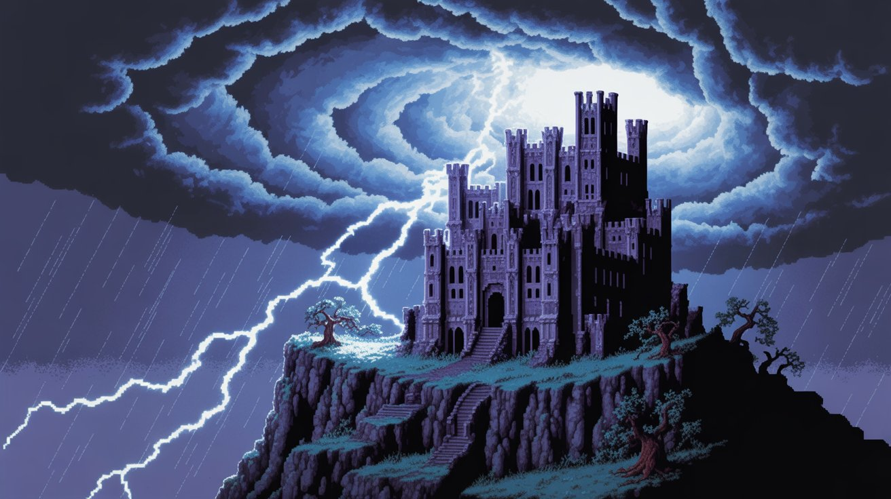

# Changelog

All notable changes to this project will be documented in this file. See [versionize](https://github.com/versionize/versionize) for commit guidelines.

## [0.4.0](https://www.github.com/tgiachi/LillyQuest/releases/tag/v0.4.0) (2026-01-28)

### Features

* add map render system skeleton ([fb53af7](https://www.github.com/tgiachi/LillyQuest/commit/fb53af753af607f86708a5959e290e433fafb44e))
* add viewport bounds helper ([6b4a35e](https://www.github.com/tgiachi/LillyQuest/commit/6b4a35eb150c2cb14ffd71d9250f1c348911be31))
* add viewport update system to rogue scene ([a0c549e](https://www.github.com/tgiachi/LillyQuest/commit/a0c549e31ce2c2e42ad5459fcd66ebce32c1c90a))
* add viewport updateable interface ([33dcef7](https://www.github.com/tgiachi/LillyQuest/commit/33dcef74dc561ec2ba08a5a6ff63c25599d61a1d))
* mark dirty chunks on movement ([8757df1](https://www.github.com/tgiachi/LillyQuest/commit/8757df12b5c36b4652df84a7a626c30a5a5bdcdf))
* rebuild dirty chunks during update ([65cb1c0](https://www.github.com/tgiachi/LillyQuest/commit/65cb1c0f0718cda4e0fbe29377a753e8fe89d6b4))
* track dirty chunks ([f8dc4cd](https://www.github.com/tgiachi/LillyQuest/commit/f8dc4cdaf4a8641804035ea6e12b093c9c6c7343))
* update visible objects and mark dirty tiles ([dbf2f05](https://www.github.com/tgiachi/LillyQuest/commit/dbf2f055916f6ce4358530da3b1685130213c404))
* wire map render system into rogue scene ([dc071ee](https://www.github.com/tgiachi/LillyQuest/commit/dc071eeb97e3c4d67477f729ee129aa70975ce38))
* **engine:** add tileset layer view lock ([8b57cfe](https://www.github.com/tgiachi/LillyQuest/commit/8b57cfe872fb0c48d5c975de1aedb6f61d0c1a5d))
* **engine:** extract TilesetSurfaceAnimator from TilesetSurfaceScreen ([70389bd](https://www.github.com/tgiachi/LillyQuest/commit/70389bd6103c0486ee5c6e3bb304174847422836))
* **engine:** extract TilesetSurfaceInputHandler from TilesetSurfaceScreen ([efb6057](https://www.github.com/tgiachi/LillyQuest/commit/efb60577e6c06232fee4751005bd852735e56d74))
* **engine:** extract TilesetSurfaceRenderer from TilesetSurfaceScreen ([63db7e7](https://www.github.com/tgiachi/LillyQuest/commit/63db7e7ebc83d8586a350ba0e4da919dc0b128cc))
* **engine:** improve view lock propagation and synchronization ([3928103](https://www.github.com/tgiachi/LillyQuest/commit/39281032c631497dd8095aa7af00745a01ae643e))
* **fov:** add IFOVService interface ([0bd686e](https://www.github.com/tgiachi/LillyQuest/commit/0bd686ecf5053317ef895c4237add8c754fed7d6))
* **fov:** implement fog of war with proper tile darkening ([4e84ab1](https://www.github.com/tgiachi/LillyQuest/commit/4e84ab1a8f0a42fd45b89430de457f226d9ff31b))
* **fov:** implement FOVService with shadowcasting ([3be4906](https://www.github.com/tgiachi/LillyQuest/commit/3be4906f06de01045e0dde8bd58034c07997c0b2))
* **fov:** integrate FOVService into RogueScene rendering ([f3fccbc](https://www.github.com/tgiachi/LillyQuest/commit/f3fccbc731582947a2a574df5da1c13fa2bb43b8))
* **game:** add torch light overlay system ([b3aa569](https://www.github.com/tgiachi/LillyQuest/commit/b3aa569b8d42b1c732c6136c3e9869d668c5c49d))
* **game:** implement player movement with keyboard shortcuts ([47aadd7](https://www.github.com/tgiachi/LillyQuest/commit/47aadd7ab8dab7bab5f32d18d547d169fcb11061))
* **game:** implement RogueScene with map rendering ([c4f8293](https://www.github.com/tgiachi/LillyQuest/commit/c4f8293db1115420e7c7daaa9b0fad8a3bb12841))
* **rendering:** add light background overlay system ([f9acf90](https://www.github.com/tgiachi/LillyQuest/commit/f9acf904f188f90d639600058ad64017a3c38963))
* **rendering:** enhance MapRenderSystem with improved logic and tests ([e74d873](https://www.github.com/tgiachi/LillyQuest/commit/e74d8739ff2a64b8958712e5b0d117bd27ff9af4))
* **roguelike:** add collection serialization support and improve color service ([f9a1528](https://www.github.com/tgiachi/LillyQuest/commit/f9a15286b46c0d096ab714a82e67a4282b43d4f6))
* **roguelike:** add light source component ([dba1088](https://www.github.com/tgiachi/LillyQuest/commit/dba10880b2f3d44cbc7beaf3f8e4212f1334738b))
* **roguelike:** add map generation system ([825d529](https://www.github.com/tgiachi/LillyQuest/commit/825d5296c6d488a3e750a8598090ac2d34bf044f))
* **roguelike:** add resolved terrain data ([db13553](https://www.github.com/tgiachi/LillyQuest/commit/db13553c31705e73540aa77dede16c94d8aa23b5))
* **roguelike:** add terrain data ([88e443c](https://www.github.com/tgiachi/LillyQuest/commit/88e443cbc722c3037b70f583ed90f90e9c81918c))
* **roguelike:** add TerrainService ([630a6a4](https://www.github.com/tgiachi/LillyQuest/commit/630a6a4ad432ec3268f2e64c36972565e3e27301))
* **roguelike:** add tick system and event-driven FOV updates ([8491544](https://www.github.com/tgiachi/LillyQuest/commit/8491544917c0aa451f48a76c61dc59692ca29874))
* **roguelike:** add torch light component ([b273083](https://www.github.com/tgiachi/LillyQuest/commit/b273083bc921d2b3c9ac99bd95295cd1ec7f2422))
* **roguelike:** enhance map and item systems with additional functionality ([449a265](https://www.github.com/tgiachi/LillyQuest/commit/449a2659d2f466ea27c7ac520142b4d657c5e4ea))
* **roguelike:** expose tileset fallback ([772e005](https://www.github.com/tgiachi/LillyQuest/commit/772e0051ff1b4fcae22f1c2eb7f4601a65ef7867))
* **roguelike:** implement base game objects hierarchy ([e05453e](https://www.github.com/tgiachi/LillyQuest/commit/e05453e038a299420af1b9699aade657e47ca3ee))
* **roguelike:** implement complete tick system with action queue ([7580872](https://www.github.com/tgiachi/LillyQuest/commit/7580872f3cd9b44178a612910a7b57a466fee62a))
* **roguelike:** implement map system with GoRogue integration ([d3fd87b](https://www.github.com/tgiachi/LillyQuest/commit/d3fd87bd4b95efe76b0e5a17ed69e2dc2c667679))
* **roguelike:** implement player spawning and map rendering improvements ([e03341a](https://www.github.com/tgiachi/LillyQuest/commit/e03341a3f56b229b8e430d09b31adbccffe84eef))
* **roguelike:** update FOV display after player movement ([511598e](https://www.github.com/tgiachi/LillyQuest/commit/511598e613443a7fb679c0b34a3f836d0b52fce9))
* **roguelike:** update map generation algorithm to cellular automata ([832513c](https://www.github.com/tgiachi/LillyQuest/commit/832513cf34115ee812124ed72ce4656945e64675))

### Bug Fixes

* **fov:** add Distance.Euclidean to FOV calculation and update tests ([ff44b7f](https://www.github.com/tgiachi/LillyQuest/commit/ff44b7f0ad62872426d663379c25530538653711))
* **roguelike:** fallback to first colorset when none specified ([eaed8a7](https://www.github.com/tgiachi/LillyQuest/commit/eaed8a7e63dea21db93597fa57d5259931dd1e64))

## [0.3.0](https://www.github.com/tgiachi/LillyQuest/releases/tag/v0.3.0) (2026-01-27)

### Features

* add directory file search results ([bb5c66e](https://www.github.com/tgiachi/LillyQuest/commit/bb5c66e1eeab4865afe913202b94f1270aa415b9))
* add font handle implementations ([8ad4f8f](https://www.github.com/tgiachi/LillyQuest/commit/8ad4f8f04e827cf099e638bd090cdb1e627255c0))
* add FontRef and IFontHandle ([f54fe1b](https://www.github.com/tgiachi/LillyQuest/commit/f54fe1b437c04974c72e2826eacf5650d3e9a2f9))
* add generic bbcode parser ([a123d52](https://www.github.com/tgiachi/LillyQuest/commit/a123d527fd18aadac9e99199755837af3e24861e))
* add headless bootstrap for tests ([cd4bd1b](https://www.github.com/tgiachi/LillyQuest/commit/cd4bd1bdfccd172438e48d8e6a29af96f9f9d9ea))
* add lua table reader helpers ([a8842d6](https://www.github.com/tgiachi/LillyQuest/commit/a8842d6d62d8bff0968e82686e7277113d70bf5f))
* add main thread dispatcher service ([2bff34c](https://www.github.com/tgiachi/LillyQuest/commit/2bff34cd84dac2ef835ec098727bbefbf64f8f18))
* add plugin lua script directory to engine ([38c9755](https://www.github.com/tgiachi/LillyQuest/commit/38c975545b1f0c578d2e4ee1eca2a8bec76901fd))
* add RogueLike JSON tests and align UI focus children ([e4675cf](https://www.github.com/tgiachi/LillyQuest/commit/e4675cf19cae87a1ee8ff71846f23b5d121f9052))
* add typewriter queue ([8c0e156](https://www.github.com/tgiachi/LillyQuest/commit/8c0e156ce7803fd858f29822c35f9e8d0aff34b3))
* add typewriter rendering and bbcode styling to log screen ([6952f55](https://www.github.com/tgiachi/LillyQuest/commit/6952f555c7ac018cbd54e4e58f462778f2d8f833))
* allow lua engine to add search directories ([7b82e47](https://www.github.com/tgiachi/LillyQuest/commit/7b82e473a62769683cdd54def5844ecbb58cc7d7))
* auto-scale tile view via per-layer render scale ([6d071fd](https://www.github.com/tgiachi/LillyQuest/commit/6d071fddd98d85f522faddb19273cc3f32714c4e))
* bind main thread dispatcher to render context ([57d82e6](https://www.github.com/tgiachi/LillyQuest/commit/57d82e6dc7299b8e19360d47f381ea3bbdc6462e))
* invoke OnDirectories with plugin root ([39d0c45](https://www.github.com/tgiachi/LillyQuest/commit/39d0c45ca7ff9ab7c766f74f27d2f883564f5bc8))
* load lua before ready/render resource hooks ([3120a77](https://www.github.com/tgiachi/LillyQuest/commit/3120a7703d16897ef30ae591dad62e4b8d21a327))
* render log lines immediately without typewriter ([a552894](https://www.github.com/tgiachi/LillyQuest/commit/a55289495a9b9d2e90cb78aedde81c0b9eb5c80a))
* support multiple lua search directories ([5eb251b](https://www.github.com/tgiachi/LillyQuest/commit/5eb251b30aeeb737eed77dd11f56f430453ca3a5))
* use LuaField names in lua meta generation ([d2555b3](https://www.github.com/tgiachi/LillyQuest/commit/d2555b38f03f0dd9c5df591376b5255ade4bbc4e))
* **bootstrap:** add AsyncResourceLoader for non-blocking plugin resource loading ([a321490](https://www.github.com/tgiachi/LillyQuest/commit/a321490f3c7909183e45dd6c36f7f36ac65d3e7e))
* **bootstrap:** add environment variable support and path resolution ([7fcc22b](https://www.github.com/tgiachi/LillyQuest/commit/7fcc22b550a6c2daf765d1d6410a03b7438d117b))
* **bootstrap:** add OnReadyToRender and OnLoadResources public methods with comprehensive test coverage ([e7abc5b](https://www.github.com/tgiachi/LillyQuest/commit/e7abc5bb80bac199d9fa4c5b9300e828a5fbb0c8))
* **bootstrap:** add plugin lifecycle hooks (OnEngineReady, OnReadyToRender, OnLoadResources) with TDD tests ([c7bd05d](https://www.github.com/tgiachi/LillyQuest/commit/c7bd05d1257a59253df7f963d3a010f79ad5e2cb))
* **bootstrap:** add window resize event with frame skipping and debouncing ([ac4f43f](https://www.github.com/tgiachi/LillyQuest/commit/ac4f43f9c57fc7e07473367be6246debbb787432))
* **bootstrap:** integrate plugin lifecycle executor into bootstrap initialization ([37665c1](https://www.github.com/tgiachi/LillyQuest/commit/37665c1ac8b031a7fd23b6feb3ec8b594224b1aa))
* **data-loader:** add data verification methods ([56b3963](https://www.github.com/tgiachi/LillyQuest/commit/56b3963fc0aca4b6581aedc5645e7ab2cd1dc2f5))
* **data-loader:** implement data loading system with configuration and receiver pattern ([b23d562](https://www.github.com/tgiachi/LillyQuest/commit/b23d5622b0aef632cebc27942774b6b4a1060728))
* **engine:** add scene logging and debug exploration utilities ([b208713](https://www.github.com/tgiachi/LillyQuest/commit/b208713b9b801623f0823a3fc2594414982c9614))
* **EngineRenderContext:** remove unnecessary blank line for cleaner code ([f11dbd7](https://www.github.com/tgiachi/LillyQuest/commit/f11dbd7d2ff8335cd87dabfdeeee4d6cf26d600c))
* **fonts:** add TopazPlus font and update font references in LogScene and LogScreen to use the new font ([17d1ea7](https://www.github.com/tgiachi/LillyQuest/commit/17d1ea79029e379d90d9bc63f177df994d3a9230))
* **game:** add UI menu demo scene ([01c6bf1](https://www.github.com/tgiachi/LillyQuest/commit/01c6bf12af4533299a45cfc93bab056d77a7b7e9))
* **game:** add UI widgets demo scene ([f225624](https://www.github.com/tgiachi/LillyQuest/commit/f22562448ee1eb6d2d8267570abcd1db028908a2))
* **JsonContext:** add LillyQuestRogueLikeJsonContext for type-safe JSON serialization and deserialization of game entities ([18ceec8](https://www.github.com/tgiachi/LillyQuest/commit/18ceec885ead338038b520720fa9472582f3bc3e))
* **logging:** implement carriage return support for progress logging ([c7649b4](https://www.github.com/tgiachi/LillyQuest/commit/c7649b4a4a2a91342f304967ed9610d24062311d))
* **plugin:** implement DirectoriesToCreate for automatic directory setup ([6a6c49e](https://www.github.com/tgiachi/LillyQuest/commit/6a6c49e5b058d325a748fa096f113897da9186e5))
* **plugins:** add InitScriptName to plugin configuration and initialize script directories ([2594d0d](https://www.github.com/tgiachi/LillyQuest/commit/2594d0d8d465ff1940ce6ce9f087a741c27d6596))
* **rendering:** add DPI scaling support for high-DPI displays ([13800f9](https://www.github.com/tgiachi/LillyQuest/commit/13800f9c600c64914f6248e37ce68a2dcefd54a2))
* **roguelike:** add default color schema with 21 standard colors ([2a986ef](https://www.github.com/tgiachi/LillyQuest/commit/2a986ef3413fd574b0700b4d61c6efbb06613071))
* **roguelike:** add default tileset with 9 tiles ([e92a13f](https://www.github.com/tgiachi/LillyQuest/commit/e92a13f9b86901bd83084583045980f561a6c556))
* **roguelike:** add resolved tile data ([b31f4b3](https://www.github.com/tgiachi/LillyQuest/commit/b31f4b30bfb562470a67a47cfe5120ebd2924df6))
* **roguelike:** add TileSetService ([6661e74](https://www.github.com/tgiachi/LillyQuest/commit/6661e74e17fa09912d9aaafb6da017e91022e93b))
* **roguelike:** add ToString methods to color schema entities ([25e26e3](https://www.github.com/tgiachi/LillyQuest/commit/25e26e358042223918f316b49d0f288a0bbf77a6))
* **roguelike:** register data loader service and update tileset configuration ([2369d61](https://www.github.com/tgiachi/LillyQuest/commit/2369d6102cc43291b627ea0c06aaabdff975127a))
* **rogueLike:** add DataLoaderService and IDataLoaderService interface ([ae6c740](https://www.github.com/tgiachi/LillyQuest/commit/ae6c74037aa422fe202417da1f9193c949c9688f))
* **rogueLike:** set window title and initialize render context ([7d0b29d](https://www.github.com/tgiachi/LillyQuest/commit/7d0b29dfe9e3ce6288caa0ef72bd123d3621f87e))
* **services:** implement data loader with entity management ([c51803e](https://www.github.com/tgiachi/LillyQuest/commit/c51803e49ed7c46fddb864479770fbc74c4ef108))
* **solution:** add LillyQuest.RogueLike project to the solution for enhanced functionality ([fa13c49](https://www.github.com/tgiachi/LillyQuest/commit/fa13c49226f53a4b1f0d8a7993957d097497800a))
* **ui:** add centering helpers to UIScreenControl ([5bdee25](https://www.github.com/tgiachi/LillyQuest/commit/5bdee25614ddd4f8ca9416f4f547c10e6cc09b3b))
* **ui:** add UIMenu with keyboard and mouse navigation ([e1047c6](https://www.github.com/tgiachi/LillyQuest/commit/e1047c63f7a3761ed4e6366721bb5a25ef1765e3))
* **ui:** add UIProgressBar ([78c1498](https://www.github.com/tgiachi/LillyQuest/commit/78c14988a863816e20933aad0f11f481620c4559))
* **ui:** add UITextBox component with demo scene and tests ([066ef2f](https://www.github.com/tgiachi/LillyQuest/commit/066ef2fbf9572d9ef63a0a7cdb20ab5d94ff1081))
* **ui:** add window autosize with content padding ([eeea52b](https://www.github.com/tgiachi/LillyQuest/commit/eeea52b0d7893dac6dfe6b88e249c82e17e841d5))
* **ui:** forward key input to focused controls ([668cc5a](https://www.github.com/tgiachi/LillyQuest/commit/668cc5a80463a5614d901668b04b26a49f2bc322))
* **ui:** recenter controls on UI root resize ([2743dee](https://www.github.com/tgiachi/LillyQuest/commit/2743dee6dd63a375178729b8a0ebf559ff90be20))

### Bug Fixes

* accumulate fractional typewriter progress ([ac8b6ed](https://www.github.com/tgiachi/LillyQuest/commit/ac8b6edc89c5cc1c119c9b51dd181e9a663d75b4))
* bind main thread invoke handler ([17da22d](https://www.github.com/tgiachi/LillyQuest/commit/17da22dda0f612029fb356e95c2b56d93ca5e95e))
* normalize directory casing and skip headless tests ([a451631](https://www.github.com/tgiachi/LillyQuest/commit/a4516312c7b6adab826172117a94e74d335231c5))
* respect external screen size for tile view scaling ([1b1d66d](https://www.github.com/tgiachi/LillyQuest/commit/1b1d66d59a88a8f86742712e011504c8b0665fd7))
* restore font draw scale ([d6b2e9a](https://www.github.com/tgiachi/LillyQuest/commit/d6b2e9ade1371f0739b5082859197519cc983d36))
* rewrap log lines on resize ([e24f7db](https://www.github.com/tgiachi/LillyQuest/commit/e24f7db5ddb52abdb0073d0d8d689ebeb1565985))
* **bootstrap:** call ExecuteOnLoadResources and show LogScene during resource loading ([c2a3ff5](https://www.github.com/tgiachi/LillyQuest/commit/c2a3ff5de4c17962c7919a6d1d3b87de6f713ef9))
* **engine:** account for layer render scale in text mapping ([41e6837](https://www.github.com/tgiachi/LillyQuest/commit/41e6837a01d70561d13035d88d7a7791c8d5906e))
* **game:** center menu demo using window size ([982a5f9](https://www.github.com/tgiachi/LillyQuest/commit/982a5f96232abed05d9229d34080bdb09882927b))
* **game:** update tileset surface editor scene ([4210aba](https://www.github.com/tgiachi/LillyQuest/commit/4210aba5423dec664030349f0890005fbe166bfe))
* **game:** use bootstrap resize for menu demo ([8ceea04](https://www.github.com/tgiachi/LillyQuest/commit/8ceea0450da5d7447d1c7b4ef116ca2109fde48d))
* **LillyQuestRogueLikePlugin.cs:** increase the range of assets loaded from 14 to 140 to include more resources ([4ed3a4c](https://www.github.com/tgiachi/LillyQuest/commit/4ed3a4cd53be0d38b02bfbc75b49c5d3a615e146))
* **lillyRoot:** update library path in .luarc.json to reflect user directory change for compatibility on macOS ([2c82126](https://www.github.com/tgiachi/LillyQuest/commit/2c821268eaeb55031b83d138b15646eaa6fd2473))

## [0.2.0](https://www.github.com/tgiachi/LillyQuest/releases/tag/v0.2.0) (2026-01-23)

### Features

* add debug UI controls panel and scrollbar tint customization ([d491783](https://www.github.com/tgiachi/LillyQuest/commit/d491783066186d5c786b8cc48175da12b95232b5))
* add draggable nine-patch window ([59b5932](https://www.github.com/tgiachi/LillyQuest/commit/59b59327e5beef783134041a1e6fd2544889110f))
* add font measurement and UI enhancements ([cd1e183](https://www.github.com/tgiachi/LillyQuest/commit/cd1e183b2ba3060367332996625f1cef43da656b))
* add LyColor hex parsing ([e32fb89](https://www.github.com/tgiachi/LillyQuest/commit/e32fb8934dc6c7bc47753766a63342e1236fdc2d))
* add modal overlay handling in UIRootScreen ([8147732](https://www.github.com/tgiachi/LillyQuest/commit/81477326d913aa67fa1b9af78b5262f675836d1a))
* add nine-patch tint colors ([d6824aa](https://www.github.com/tgiachi/LillyQuest/commit/d6824aad0624be1e52eaa056f1d3d8fc1d0aeab3))
* add nine-patch window basics ([57a06b6](https://www.github.com/tgiachi/LillyQuest/commit/57a06b60c85947763ce68b50e5cf8257543ab9cb))
* add nine-slice asset manager ([6ce65fc](https://www.github.com/tgiachi/LillyQuest/commit/6ce65fc6ee7941682c092e675c4616533d6513dd))
* add nine-slice embedded resource loader ([8106dbd](https://www.github.com/tgiachi/LillyQuest/commit/8106dbda54a295f758b9e56be127676c64df0336))
* add nine-slice load overloads ([b50a8af](https://www.github.com/tgiachi/LillyQuest/commit/b50a8af061afb34d7a487372ac00825d6957980d))
* add nine-slice window demo ([1657b13](https://www.github.com/tgiachi/LillyQuest/commit/1657b13e6d6a21117936ca86ae711e38d8be2e6a))
* add texture patch registration and retrieval to NineSliceAssetManager ([c684b05](https://www.github.com/tgiachi/LillyQuest/commit/c684b051cec34e5c554f36ca12d78dadc42bbbb0))
* add UIButton control ([fccdd15](https://www.github.com/tgiachi/LillyQuest/commit/fccdd1540a6b35e8ae72b71469642f80f89eacb6))
* add UIButton demo window ([c649258](https://www.github.com/tgiachi/LillyQuest/commit/c649258a55afb535fa8f36d06fba5b3a4d064173))
* add UIScrollContent demo with scrollbar texture patches ([14f3085](https://www.github.com/tgiachi/LillyQuest/commit/14f3085e253d084305430bd731c0ee9e41d1d274))
* add UIScrollContent geometry ([fc8cc5a](https://www.github.com/tgiachi/LillyQuest/commit/fc8cc5a8983b79caf81fe2d202391a706c13c2a8))
* add UIScrollContent mouse wheel ([f1e7611](https://www.github.com/tgiachi/LillyQuest/commit/f1e76118c81c79895821ec07d43cde1960b5f459))
* add UIStackPanel layout container ([33bd538](https://www.github.com/tgiachi/LillyQuest/commit/33bd538ccae88d46c682931d875085efc93c3c5f))
* add UIWindow resize with min/max ([902b10c](https://www.github.com/tgiachi/LillyQuest/commit/902b10c32a1dbf61fe3fa5bf765584b7a5133c14))
* bring focused windows to front ([e5db47b](https://www.github.com/tgiachi/LillyQuest/commit/e5db47bce8914971a1f8e37ed0695db1085445bf))
* render nine-slice window ([682fc92](https://www.github.com/tgiachi/LillyQuest/commit/682fc929942ac274885d2914d977badcf761fd75))
* render UIScrollContent ([7beda7d](https://www.github.com/tgiachi/LillyQuest/commit/7beda7d6beb648962edca2155d9a90d8c7622e9a))
* update UI controls each frame ([cb32ca1](https://www.github.com/tgiachi/LillyQuest/commit/cb32ca11b2bced294ed1fc069509961ead205175))
* **ui:** add child management to UIScreenControl ([f9ad74d](https://www.github.com/tgiachi/LillyQuest/commit/f9ad74d049d6014fa302954e2ef1259f9b667c8f))

### Bug Fixes

* added text color to button ([8b63385](https://www.github.com/tgiachi/LillyQuest/commit/8b633852f342d42589d6e181a6d19828deee0997))
* forward window input to active child ([0f8886e](https://www.github.com/tgiachi/LillyQuest/commit/0f8886e3cc1fdc02ef9b58cf7d69ba24dcb2121e))
* **ui:** unify focus and hit-test over base children ([13b69d6](https://www.github.com/tgiachi/LillyQuest/commit/13b69d64e6abe09b34e68c6dc387cbdba54fd3c1))

## [0.1.0](https://www.github.com/tgiachi/LillyQuest/releases/tag/v0.1.0) (2026-01-22)

### Features

* add IImGuiFeature interface to support ImGui integration in the engine ([f0f0acc](https://www.github.com/tgiachi/LillyQuest/commit/f0f0accbdc109f6e6a127812b212a67603f741de))
* add layer pixel offset and mouse events to tileset surface ([7fb10ad](https://www.github.com/tgiachi/LillyQuest/commit/7fb10ad53c22972fa1dcee770139eccc67cd0d5d))
* add layer-specific render scale with smooth zoom animation ([dca0c84](https://www.github.com/tgiachi/LillyQuest/commit/dca0c843336484b816a7da8ff19ef9afdffd5201))
* add layer-specific text drawing and multi-layer mouse event broadcasting ([0d17389](https://www.github.com/tgiachi/LillyQuest/commit/0d173899809f381e71504cbaa20e1e3a8a0d1fba))
* add screen docking and overlay enhancements ([4879c5c](https://www.github.com/tgiachi/LillyQuest/commit/4879c5c77ae60c47e3c03e37040176260cc40d7e))
* add SetLayerRenderScaleSmoothing method to control smooth zoom ([2e40c3d](https://www.github.com/tgiachi/LillyQuest/commit/2e40c3d0d4496887755789c2abbf78235d89f1f3))
* add smooth view scrolling for layer animation ([beb2138](https://www.github.com/tgiachi/LillyQuest/commit/beb21386e8ea9bbf9173683ecb9933f01e04f5a3))
* add tile movement animation system with queue-based processing ([e9e6c22](https://www.github.com/tgiachi/LillyQuest/commit/e9e6c22dd714a4b0a7de12d7b4c5b805fc299de3))
* add UI overlay system for pixel-based UI controls ([02dafbb](https://www.github.com/tgiachi/LillyQuest/commit/02dafbb561a352cc5c7bc201190fc0d11c3d798d))
* add UIRootScreen mouse capture ([fd9ac37](https://www.github.com/tgiachi/LillyQuest/commit/fd9ac37a939438387a26b6469dcc81c5eb00e2dc))
* add UIWindow clamp and child input ([4d65b30](https://www.github.com/tgiachi/LillyQuest/commit/4d65b30108e8283186ca77528c61140ee67553a0))
* add UIWindow demo ([76ded0f](https://www.github.com/tgiachi/LillyQuest/commit/76ded0fd56cf13451b849a340a49ce67838dd13e))
* add UIWindow drag basics ([76f9cdb](https://www.github.com/tgiachi/LillyQuest/commit/76f9cdb0ecc51ce18b87e33bd0e8b5b7a37f26f5))
* add UIWindow rendering basics ([c1cd968](https://www.github.com/tgiachi/LillyQuest/commit/c1cd9685567e7cb81543070a09f20a3f70e9f315))
* add view centering on right-click and TilesetSurface constructor ([2126a4f](https://www.github.com/tgiachi/LillyQuest/commit/2126a4f86764a9cdfece5155224440af447b372c))
* add view offset support for layer scrolling ([53831c3](https://www.github.com/tgiachi/LillyQuest/commit/53831c30f07225a990cfd10b9926ca78684bada4))
* added comments to extension class per draw screen ([8ac19c7](https://www.github.com/tgiachi/LillyQuest/commit/8ac19c774f48b63e9103a07890d60b32cf4e5540))
* migrate scene to UIRootScreen ([0f80ef3](https://www.github.com/tgiachi/LillyQuest/commit/0f80ef3ac8d0403ba8f39caaa4771cbb8de7206b))
* **animations:** implement tween and animation system for sequence-based animations ([291d123](https://www.github.com/tgiachi/LillyQuest/commit/291d1230d97ec500d0cb3c0e63f877178a571206))
* **assets:** add terminess_font.ttf for improved UI aesthetics ([69025d6](https://www.github.com/tgiachi/LillyQuest/commit/69025d60e74955902649c61e9c17f36b003befc2))
* **BaseScreen:** implement abstract base class for screen management with entity lifecycle ([10df09d](https://www.github.com/tgiachi/LillyQuest/commit/10df09ded10bcf9cd74eb4419345639a3799ab22))
* **BaseSystem:** implement generic base system for fixed and update systems ([7fa02a3](https://www.github.com/tgiachi/LillyQuest/commit/7fa02a3fffdd48faab61b4e1eedcd35104e4c886))
* **Bootstrap:** integrate InputFocusSystem and wire Silk.NET input events ([20a06a0](https://www.github.com/tgiachi/LillyQuest/commit/20a06a0e8bdfe7f3cf82beb6e2d0db47fbb1da0e))
* **core:** add extension methods for asset managers with embedded resource support ([3142733](https://www.github.com/tgiachi/LillyQuest/commit/31427334f42c1dbd47aadb5c1c58146d95420096))
* **core:** add IAssetManager facade for centralized asset management ([dbdbf45](https://www.github.com/tgiachi/LillyQuest/commit/dbdbf4545c2ce6f6d4503a27a3b139a9c4a649f0))
* **core:** import engine core, rendering, and lua scripting ([84f6398](https://www.github.com/tgiachi/LillyQuest/commit/84f639805608af134e41b0f1f44c67c9cd548be7))
* **csproj:** add Silk.NET.OpenGL.Extensions.ImGui package for enhanced OpenGL functionality ([87731e7](https://www.github.com/tgiachi/LillyQuest/commit/87731e734ce6b4a76e752a45c8961e9a4b32a38b))
* **debug:** add debug entities for game object inspection and input state display ([57a584a](https://www.github.com/tgiachi/LillyQuest/commit/57a584a4c7d293b90e0a938f88b4912b2bcba6f4))
* **debug:** add DebugLabelGameObject to display debug mode indicator ([e31a618](https://www.github.com/tgiachi/LillyQuest/commit/e31a618e3c79f4401e7732c310932ccee979841c))
* **DebugEntityGameObject:** create ImGui entity hierarchy viewer ([5cdc7a4](https://www.github.com/tgiachi/LillyQuest/commit/5cdc7a4f6ca1863d7fa82aba3d8ff47d49c3de72))
* **DebugEntityGameObject:** update Name property to provide a more descriptive title for the debug entity hierarchy ([a2183d7](https://www.github.com/tgiachi/LillyQuest/commit/a2183d7495b869711b70e3109c8daa53ffc6baff))
* **DebugInputGameObject:** add a debug entity to display current input state using ImGui ([d3335fd](https://www.github.com/tgiachi/LillyQuest/commit/d3335fdc48fb198b39bbba65ef3d16fc86ee3589))
* **DebugSystemGameObject:** add FPS tracking and performance metrics ([52a91ff](https://www.github.com/tgiachi/LillyQuest/commit/52a91ff98bdfb9af5d120cc3f66063d53f236f4b))
* **DebugSystemGameObject:** implement ImGui-based debug panel for system performance monitoring ([f698b4f](https://www.github.com/tgiachi/LillyQuest/commit/f698b4ffc6406f9b6ead79c6fbca971e81e47a06))
* **DebugSystemGameObject.cs:** add _allQueryTypes array to improve query type management ([c09f62c](https://www.github.com/tgiachi/LillyQuest/commit/c09f62ce8b7a83766fc9652e00a7503afc6799c3))
* **engine:** add entity systems and tests ([594a5d2](https://www.github.com/tgiachi/LillyQuest/commit/594a5d2fdece3730efd912f4ba08fa4c761fd8df))
* **engine:** add IFixedUpdateFeature and IUpdateFeature interfaces for game object features ([5cae11c](https://www.github.com/tgiachi/LillyQuest/commit/5cae11cf43248b6af60c29ca3dccc5f826105184))
* **engine:** add system management interfaces and implementations for rendering and updating systems ([0c669bd](https://www.github.com/tgiachi/LillyQuest/commit/0c669bd5ea58765d855afe5efaf382f934642218))
* **engine:** enhance GameEntityManager with ordered indexing and lifecycle events ([766ae06](https://www.github.com/tgiachi/LillyQuest/commit/766ae061133de1e6fb5b9c18f15aab29a7d3eb6c))
* **engine:** implement FixedUpdate in LillyQuestBootstrap with configurable timestep ([2a06177](https://www.github.com/tgiachi/LillyQuest/commit/2a0617710b1a55b6a994a8331f1cccfff4da5434))
* **engine:** implement GameComponentCollection with O(1) type lookup ([54fc0d6](https://www.github.com/tgiachi/LillyQuest/commit/54fc0d670b837f6ee07edb4e5ea53c744fce81e7))
* **engine:** implement GameEntity with component management and render order ([441edeb](https://www.github.com/tgiachi/LillyQuest/commit/441edeb3d2c486591aa40fdac37c6f3ee6123de5))
* **engine:** implement GameEntityManager with global component type index ([01af12b](https://www.github.com/tgiachi/LillyQuest/commit/01af12b5702a4d9a47031da683953fcff0a82a22))
* **engine:** integrate Silk.NET for windowing and OpenGL support to enhance graphics capabilities ([967b8d1](https://www.github.com/tgiachi/LillyQuest/commit/967b8d1c28b1f85b48f9842e8a59d391c969448a))
* **engine:** migrate from component-based to feature-based architecture ([04f67ac](https://www.github.com/tgiachi/LillyQuest/commit/04f67ac6c1a1d83bf960c0af682389f61c9def6f))
* **EngineRenderConfig:** update default title from "DarkLilly Engine" to "LillyQuest Engine" for branding consistency ([a5781ce](https://www.github.com/tgiachi/LillyQuest/commit/a5781cedcc0f6ee9f0f9f36c072267363b5ba1e2))
* **entities:** implement GameEntity and GameEntityCollection for managing game entities ([c0a0239](https://www.github.com/tgiachi/LillyQuest/commit/c0a02390171a03e8347241dd20c314ab7c420310))
* **GameEntity:** make Initialize method virtual to allow overriding in derived classes ([5f03802](https://www.github.com/tgiachi/LillyQuest/commit/5f038026885dbe5c1fa8deea75f64c26bcff7914))
* **GameEntity:** remove default value for Name property to allow flexibility in entity initialization ([a689997](https://www.github.com/tgiachi/LillyQuest/commit/a68999781c2b94832c2b9f7f4e080e4f0fded8a1))
* **GameTime:** add ToString method for better debugging of game time values ([a731cff](https://www.github.com/tgiachi/LillyQuest/commit/a731cff7dc7181146f6c5f689d3c3aaf4334876d))
* **IGameEntityManager:** add CreateEntity method to instantiate game entities with a specified name ([998a5c4](https://www.github.com/tgiachi/LillyQuest/commit/998a5c4e977eb3001186708fb12e89958dba452c))
* **IIMGuiEntity:** add Name property to interface for ImGui panel naming ([7b13bc9](https://www.github.com/tgiachi/LillyQuest/commit/7b13bc988c67d9ecadf93ed165c2c0d688f3b9f2))
* **ImGuiSystem:** add support for IImGuiFeature to render custom ImGui windows ([1157f87](https://www.github.com/tgiachi/LillyQuest/commit/1157f8714122e7c8be9a8edce9bedce111718a81))
* **ImGuiThemeProvider:** add Dark Fantasy theme with medieval colors ([8a39d55](https://www.github.com/tgiachi/LillyQuest/commit/8a39d550dbb6744af795fa1d406776d0294808c6))
* **ImGuiThemeProvider:** add theme system with Cyan theme support ([7068aed](https://www.github.com/tgiachi/LillyQuest/commit/7068aed10d1fcdd56691cf122e2beb8077e70216))
* **input:** refactor input handling by moving KeyModifierType to a new location and creating interfaces for keyboard and mouse input features ([c6bf290](https://www.github.com/tgiachi/LillyQuest/commit/c6bf2900118697ce26824a1a2d630240d4410796))
* **input-system:** add properties for keyboard and mouse input tracking in IInputSystem interface ([5d5ab83](https://www.github.com/tgiachi/LillyQuest/commit/5d5ab83c8415058fd997937c07d4303fbdb46dac))
* **InputFocusSystem:** add system for global screen focus management ([8997eab](https://www.github.com/tgiachi/LillyQuest/commit/8997eab4f57fe63e17c0a44028a0a0877304966b))
* **interfaces:** implement core ECS interfaces with improved type safety ([97ef24c](https://www.github.com/tgiachi/LillyQuest/commit/97ef24ccc4327d0be4a0a97cc2f7650cb28f6057))
* **IScreenManager:** add PopScreen method to remove specific screen from stack if it matches ([c35c360](https://www.github.com/tgiachi/LillyQuest/commit/c35c36068ab5b20df995c193ddefbf3e231b32c4))
* **LillyQuestBootstrap:** add loading of default fonts from embedded resources to enhance text rendering capabilities ([35145ba](https://www.github.com/tgiachi/LillyQuest/commit/35145ba50842c773534a0a2159e8dce30f767f4c))
* **LillyQuestBootstrap:** add timing properties for render and update processes to measure performance ([7012c4d](https://www.github.com/tgiachi/LillyQuest/commit/7012c4d27eb5486e5e368b97b70e1e510b6ac092))
* **LillyQuestBootstrap:** add viewport adjustment on window resize to ensure proper rendering ([b85f070](https://www.github.com/tgiachi/LillyQuest/commit/b85f0704fe8be4476f588eeed68cc9234e857c98))
* **LillyQuestBootstrap:** change _container to be mutable and update RegisterServices method to allow service registration ([30b1798](https://www.github.com/tgiachi/LillyQuest/commit/30b179896e6ef7678b059bb862da4fbe4ce6b04b))
* **LillyQuestBootstrap:** register internal services for game entity and system management to enhance architecture ([68c5111](https://www.github.com/tgiachi/LillyQuest/commit/68c511185c39203efc14f6769f6ea8a99a391708))
* **logging:** implement LogEventDispatcher for improved logging management ([265b776](https://www.github.com/tgiachi/LillyQuest/commit/265b776c155b3f05f44ab44a25516fb243880e47))
* **plugins:** add PluginExtensions for registering plugins in the DI container ([ba941db](https://www.github.com/tgiachi/LillyQuest/commit/ba941dba9875fab51616fd93bcbf5eca3ba7d37b))
* **project:** enable unsafe code blocks in LillyQuest.Engine project for advanced memory management ([92cbd47](https://www.github.com/tgiachi/LillyQuest/commit/92cbd4784325e32bcf503dba5141cbde9bb967d6))
* **SceneManagerStackTests:** add comprehensive unit tests for multi-scene stack operations ([b5151a5](https://www.github.com/tgiachi/LillyQuest/commit/b5151a594d882b79ae0efdd7c99596187ec8af98))
* **Screen:** add Screen entity with positioning, sizing, and coordinate transform ([8875ef6](https://www.github.com/tgiachi/LillyQuest/commit/8875ef67f9bebef8344af9513b86efd9af8a6a57))
* **ScreenInputFeature:** add input feature with coordinate transformation ([48e28ef](https://www.github.com/tgiachi/LillyQuest/commit/48e28ef6e2660fddefb79ff289cdd6a9c609da56))
* **screenmanager:** implement screen stack architecture with focus-based input ([e10af86](https://www.github.com/tgiachi/LillyQuest/commit/e10af86d71a4eda60d69e1266e694bac6a10891c))
* **ScreenRenderFeature:** add rendering feature with automatic scissor test ([e6907e9](https://www.github.com/tgiachi/LillyQuest/commit/e6907e995a701e963ae13bf10342ea65f7326af0))
* **ScreenSystem:** add ScreenSystem to manage screen rendering and processing ([14397ef](https://www.github.com/tgiachi/LillyQuest/commit/14397efef3a8906600a4f84fc07e13dffd952427))
* **solution:** add new services and interfaces for action and shortcut management ([5e9a498](https://www.github.com/tgiachi/LillyQuest/commit/5e9a498da3193a1b94e1af701dd5d1609ecc3ceb))
* **SpriteBatch:** add scissor test functionality to improve rendering control ([27816de](https://www.github.com/tgiachi/LillyQuest/commit/27816de65329c9e4425a825ac17ad5ec609295ef))
* **SpriteBatch:** add translation stack to manage drawing offsets for improved rendering control ([4a2f1af](https://www.github.com/tgiachi/LillyQuest/commit/4a2f1af9a85977fc071febf2be74b89d4a6b5c65))
* **SpriteGameEntity:** add SpriteGameEntity class to represent a renderable game entity ([7bc0bbe](https://www.github.com/tgiachi/LillyQuest/commit/7bc0bbe781014b2c304cc4b6000fa930fdf9f235))
* **Texture2D:** add ConfigureSampling method to allow flexible texture sampling configurations ([6f47158](https://www.github.com/tgiachi/LillyQuest/commit/6f4715802fa30d3081a322ac0492e41202e769dd))
* **TextureManager:** add methods to load textures with magenta chroma key replacement for better transparency handling ([af9cc12](https://www.github.com/tgiachi/LillyQuest/commit/af9cc12b722311484de2ac0f4856efd7ba052937))
* **TileRenderData:** add TileFlipType to support flipping tiles in rendering ([6dfe958](https://www.github.com/tgiachi/LillyQuest/commit/6dfe958b390690199057b3e3855d121d1abb587b))
* **TileRenderData:** add TileRenderData struct to encapsulate tile rendering data including colors ([b4681fa](https://www.github.com/tgiachi/LillyQuest/commit/b4681fa3e13010e775234ac4fe6f2cd6efb1c411))
* **tiles:** add TileData and Tileset classes to manage tile rendering and configuration ([a335d8d](https://www.github.com/tgiachi/LillyQuest/commit/a335d8db184bd97b2716bbcbdcc42238a37cde68))
* **tileset:** add 1d tile storage on TileLayer ([102b81d](https://www.github.com/tgiachi/LillyQuest/commit/102b81dd56e484627588f8da82d11fbe17eece21))
* **tileset:** add chunked storage for TileLayer ([02d50a2](https://www.github.com/tgiachi/LillyQuest/commit/02d50a2296d49c992db558729279d91ff8e7c5ab))
* **TilesetSurface:** add mouse wheel handling for tile interaction to enhance user experience ([bfc58e9](https://www.github.com/tgiachi/LillyQuest/commit/bfc58e97fcedac57a3c25d876e85038ce00fd23a))
* **TilesetSurface:** adjust tile scaling to consider layer-specific render scale for accurate rendering ([66a3135](https://www.github.com/tgiachi/LillyQuest/commit/66a3135c579d4df6a390f8facf5b651df1dc12ce))
* **TilesetSurfaceEditorScene:** add example scene with random tile population ([006faa8](https://www.github.com/tgiachi/LillyQuest/commit/006faa84f44e51be30f9d447f6e9f800689fb587))
* **TilesetSurfaceEditorScene:** add size property to tileset surface editor scene for better layout control ([a05807d](https://www.github.com/tgiachi/LillyQuest/commit/a05807d19db1442d2b279ff22e93e2db2c1920b1))
* **TilesetSurfaceEditorScene:** populate entire surface with random tiles ([9905787](https://www.github.com/tgiachi/LillyQuest/commit/990578779b38e5e367e134484a7eed6d89ad800d))
* **TilesetSurfaceScreen:** configure 90x30 tile grid with 24x24 scale ([0a8a8e8](https://www.github.com/tgiachi/LillyQuest/commit/0a8a8e86db165840123829f551ec9ea6e4e56e50))
* **TilesetSurfaceScreen:** implement tile render scaling and frustum culling ([33f1dab](https://www.github.com/tgiachi/LillyQuest/commit/33f1dab691763632732c5d96134b0f723efc91f9))
* **TilesetSurfaceScreen:** implement tileset surface editor with multi-layer support ([59ba67e](https://www.github.com/tgiachi/LillyQuest/commit/59ba67ef8d5037f706c9e2e4d608f643dfcd1c41))

### Bug Fixes

* correct license file reference from LICENZE to LICENSE in all csproj files ([5e3acb2](https://www.github.com/tgiachi/LillyQuest/commit/5e3acb2c8a2ceb4653b9cb0c58056c0a428f560e))
* removed plan and fixed imGuiSystem ([9a82230](https://www.github.com/tgiachi/LillyQuest/commit/9a82230a667cb848f19ecf3569444f78cdcfdab1))
* **LillyQuestBootstrap.cs:** add warning log for unregistered scenes to improve debugging and error handling ([100100c](https://www.github.com/tgiachi/LillyQuest/commit/100100c1ac38c3fe184aabeb4f03c547edc6b7f8))
* **ScreenRenderFeature:** fix coordinate system and scissor cleanup ([73e54a4](https://www.github.com/tgiachi/LillyQuest/commit/73e54a4fdfa9b293e65114b8a3a7924aa2bf08bf))
* **shader:** remove ValidateProgram from constructor for OpenGL Core compatibility ([f675dc5](https://www.github.com/tgiachi/LillyQuest/commit/f675dc55909d19c17cf60375f82a0afbfb1d7d3b))
* **shaders:** update spritebatch shaders to GLSL 330 core syntax ([fde9413](https://www.github.com/tgiachi/LillyQuest/commit/fde94134a768d3ff44b7699b2893af39a1c78b2c))
* **tests:** resolve all compiler warnings in test suite ([d4633af](https://www.github.com/tgiachi/LillyQuest/commit/d4633af0b1bf63ef6987f44153eb851669072aef))
* **TilesetSurfaceEditorScene:** reduce tile population to 400 for smooth performance ([4e89d63](https://www.github.com/tgiachi/LillyQuest/commit/4e89d63fbc224403e85174eb5c988ab94fbd2481))
* **TilesetSurfaceEditorScene:** reduce to single layer to prevent blocking ([bbff7fb](https://www.github.com/tgiachi/LillyQuest/commit/bbff7fb52e6d7e6b50039edc2d7cc56e57eb3d41))
* **TilesetSurfaceScreen:** fix initialization order for early population ([3db490d](https://www.github.com/tgiachi/LillyQuest/commit/3db490d6def606363d88b713829818a8c0ad999c))
* **TilesetSurfaceScreen:** render tiles with proper UV coordinate normalization ([7987def](https://www.github.com/tgiachi/LillyQuest/commit/7987defc6276b6f5102081a99e81362edc163e64))

